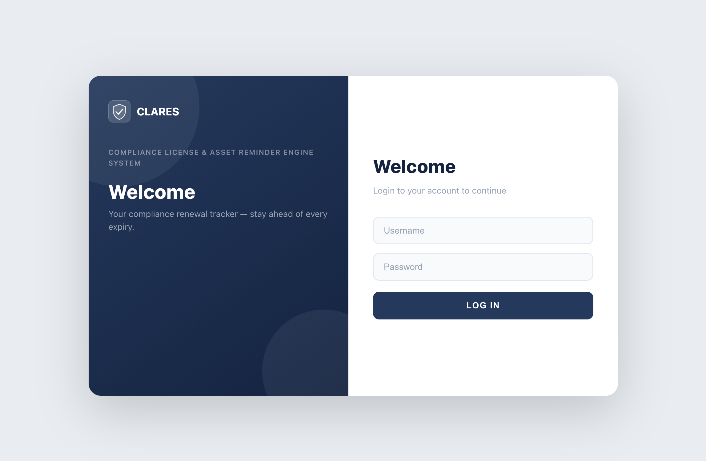

# CLARES — Compliance License & Asset Reminder Engine System

A full-stack web portal for tracking and managing expiry dates of SSL certificates, licenses, certificates, and any custom asset type. Sends email reminders before items expire.



---

## How It Works

1. **Login** — Users authenticate with username/password. The server issues a JWT token (8h expiry) stored in `sessionStorage`. Deactivated accounts receive a clear "account deactivated" message.

2. **Dashboard** — On login, users land on the Dashboard which automatically fetches all renewal items and groups them by urgency: **Expired**, **Critical (≤14 days)**, **Warning (≤30 days)**, and **Upcoming (≤90 days)**. Summary stat cards show counts per catalog type.

3. **Catalogs** — The sidebar lists all catalog types the user has access to. Clicking a catalog opens its item list. Users with **Admin** role (global or catalog-level) can add, edit, delete, and bulk-upload entries. **Viewers** can only browse.

4. **Permissions** — Global admins see everything. Other users only see catalogs they've been granted access to via the per-catalog permission matrix (No Access / View / Admin). Catalog-level admins can manage entries in their assigned catalogs without being global admins.

5. **Email Reminders** — Admins configure SMTP settings (host, port, TLS, credentials, sender address) from the SMTP Settings page. Each item has per-entry reminder settings: enable/disable, days before expiry, and repeat count. The system calculates exact reminder dates by evenly spacing the repeat count within the days-before window. For example, an item expiring June 10 with "30 days before, repeat 3 times" gets reminders on May 11, May 21, and May 31. Reminders can be triggered manually or run automatically via the built-in daily scheduler.

6. **Automatic Reminder Scheduler** — When enabled in Admin Settings, a background scheduler checks every 60 seconds and sends reminders once per day at the configured hour (server time). A `reminder_logs` table tracks which reminder number has been sent for each item, preventing duplicates. Past-due reminders that were missed (e.g., server was down) are caught up automatically.

7. **Deployment** — The app is containerized with Docker (multi-arch amd64/arm64) and deployed via Helm on Kubernetes. The frontend is built by Vite into static files served by Express alongside the API.

---

## Tech Stack

| Layer      | Technology                        |
|------------|-----------------------------------|
| Frontend   | React 18, Vite, React Router v6   |
| Backend    | Node.js, Express 4                |
| Database   | PostgreSQL (Azure)                |
| Auth       | JWT (8h expiry), bcrypt           |
| Email      | Nodemailer (configurable SMTP)    |
| Dev tools  | concurrently, nodemon             |

---

## Prerequisites

- Node.js 18+
- A PostgreSQL database (Azure or local)
- An SMTP server (optional, for email reminders)

---

## Getting Started

### 1. Clone & install

```bash
git clone <repo-url>
cd clares
npm install
```

### 2. Configure environment

Create a `.env` file in the project root:

```env
# PostgreSQL connection
PGHOST=your-db-host.postgres.database.azure.com
PGPORT=5432
PGDATABASE=your-database-name
PGUSER=your-db-user
PGPASSWORD=your-db-password

# JWT secret (use a long random string)
JWT_SECRET=your_super_secret_jwt_key

# Server port (optional, default: 3002)
PORT=3002

# Frontend origin (optional, default: http://localhost:5174)
CLIENT_ORIGIN=http://localhost:5174
```

### 3. Set up the database

Run the migration script to create all required tables and seed built-in catalog types:

```bash
npm run setup-db
```

This creates:
- `renewals` — tracked items with expiry dates
- `catalog_types` — asset categories (ssl, license, certificate + any custom)
- `smtp_config` — email sender configuration + auto-reminder schedule
- `reminder_logs` — tracks which reminder emails have been sent (prevents duplicates)
- `user_catalog_permissions` — per-user access control per catalog

> Re-running `setup-db` is safe — all migrations are idempotent.

### 4. Default admin account

The `setup-db` script automatically seeds a default admin user when the `users` table is empty:

| Field    | Value          |
|----------|----------------|
| Username | `admin`        |
| Password | `admin`        |
| Role     | `admin`        |

> **Important:** Change the default password immediately after first login via User Management.

### 5. Start the development server

```bash
npm run dev
```

This starts both servers concurrently:
- **Frontend**: http://localhost:5174
- **API**: http://localhost:3002

---

## Available Scripts

| Command           | Description                                    |
|-------------------|------------------------------------------------|
| `npm run dev`     | Start frontend (Vite) + backend (nodemon)      |
| `npm run build`   | Build frontend for production                  |
| `npm run preview` | Preview the production build locally           |
| `npm run setup-db`| Run DB migration / setup script               |

---

## Project Structure

```
├── index.html
├── package.json
├── vite.config.js
│
├── server/                     # Express API
│   ├── index.js                # Entry point
│   ├── db.js                   # PostgreSQL pool
│   ├── setup.js                # DB migration script
│   ├── middleware/
│   │   ├── authenticate.js     # JWT verification
│   │   └── requireAdmin.js     # Admin-only guard
│   └── routes/
│       ├── auth.js             # Login / profile
│       ├── renewals.js         # CRUD for renewal entries + bulk import
│       ├── catalog-types.js    # Manage catalog categories
│       └── admin.js            # SMTP config, email reminders, user management
│
└── src/                        # React frontend
    ├── main.jsx
    ├── App.jsx                 # Route definitions
    ├── components/
    │   ├── ClaresLogo.jsx      # Reusable shield logo SVG
    │   ├── Layout.jsx          # App shell (navbar + sidebar)
    │   ├── Sidebar.jsx         # Left navigation with catalog list
    │   ├── Login.jsx           # Split-panel login page
    │   ├── ProtectedRoute.jsx  # Auth guard component
    │   └── RenewalAlertModal.jsx
    ├── context/
    │   └── AuthContext.jsx     # Auth state + login/logout
    ├── pages/
    │   ├── HomePage.jsx        # Dashboard — expiry attention view
    │   ├── CatalogPage.jsx     # Per-catalog CRUD + bulk CSV upload
    │   ├── AdminPage.jsx       # SMTP settings + send reminders
    │   └── UserManagementPage.jsx  # Add/edit users + permissions
    └── services/
        └── api.js              # All API client calls
```

---

## Features

### Dashboard (Home)
- Grouped urgency sections: **Expired**, **Critical ≤14d**, **Warning ≤30d**, **Upcoming ≤90d**
- Summary stat cards per catalog type
- Auto-refreshed on load — no manual refresh needed

### Catalogs
- Built-in types: **Certificates**, **Licenses**, **SSL Certs**
- Add custom catalog types from the sidebar
- Per-catalog item management (add, edit, delete)
- **Bulk CSV upload** — download template, upload up to 500 rows at once
- Per-item **email reminder** settings (toggle, days before, repeat count)
- Catalog-level admin: users with catalog "Admin" permission can add/edit/delete entries without being global admins

### Email Reminders
- Configure SMTP (host, port, TLS, credentials, from address)
- Test SMTP connection and **send test emails** to verify delivery
- Per-item reminder settings: toggle on/off, days before expiry, repeat count
- **Smart reminder scheduling**: calculates exact send dates by evenly spacing repeats within the reminder window (e.g., 30 days / 3 repeats = reminders at 30, 20, and 10 days before expiry)
- Trigger reminders manually from Admin page
- Sends formatted HTML emails to item `owner` field (must contain `@`)
- Emails include reminder number (e.g., "reminder 2 of 3")

### Automatic Reminders
- Enable/disable automatic daily reminders from Admin Settings
- Configure the send hour (0–23, server time)
- Background scheduler checks every 60 seconds, fires once per day at the configured hour
- `reminder_logs` table prevents duplicate sends — each reminder number per item is tracked
- Missed reminders (server downtime) are automatically caught up on next run
- Request logging for all API calls visible in pod logs

### User Management *(Admin only)*
- Create and manage user accounts
- Assign global role: **Admin** (full access) or **Viewer** (read-only)
- Per-catalog permission matrix: **No Access** / **View** / **Admin**
- Catalog-level admin grants add/edit/delete for specific catalogs
- Activate / deactivate accounts (deactivated users see a clear message on login)

### Security & Auth
- JWT authentication with configurable expiry (default 8h)
- Passwords hashed with bcrypt (12 rounds)
- Role-based access control on every API endpoint
- Case-insensitive login
- Inactive account detection with user-friendly error message
- Sessions stored in `sessionStorage` — cleared on tab close

### UI
- Responsive layout — sidebar collapses on mobile, toggles on desktop
- Collapsible left sidebar via hamburger button
- Top-right dropdown menu for admin settings and sign out
- Navy/white color scheme

---

## API Endpoints

| Method | Path                              | Auth     | Description                    |
|--------|-----------------------------------|----------|--------------------------------|
| POST   | `/api/auth/login`                 | Public   | Login, returns JWT             |
| GET    | `/api/renewals`                   | Required | All renewals                   |
| GET    | `/api/renewals/type/:type`        | Required | Renewals by catalog type       |
| POST   | `/api/renewals`                   | Admin*   | Create renewal                 |
| PUT    | `/api/renewals/:id`               | Admin*   | Update renewal                 |
| DELETE | `/api/renewals/:id`               | Admin*   | Delete renewal                 |
| POST   | `/api/renewals/bulk`              | Admin*   | Bulk create (max 500 rows)     |
| GET    | `/api/catalog-types`              | Required | List catalog types             |
| POST   | `/api/catalog-types`              | Admin    | Add custom catalog type        |
| DELETE | `/api/catalog-types/:slug`        | Admin    | Delete custom catalog type     |
| GET    | `/api/admin/smtp`                 | Admin    | Get SMTP config                |
| PUT    | `/api/admin/smtp`                 | Admin    | Save SMTP config               |
| POST   | `/api/admin/smtp/test`            | Admin    | Test SMTP connection           |
| POST   | `/api/admin/smtp/test-email`      | Admin    | Send test email                |
| POST   | `/api/admin/send-reminders`       | Admin    | Send email reminders           |
| GET    | `/api/admin/users`                | Admin    | List users                     |
| POST   | `/api/admin/users`                | Admin    | Create user                    |
| PUT    | `/api/admin/users/:id`            | Admin    | Update user                    |
| GET    | `/api/admin/users/:id/permissions`| Admin    | Get user catalog permissions   |
| PUT    | `/api/admin/users/:id/permissions`| Admin    | Set user catalog permissions   |

---

> **Admin\*** = Global admin OR catalog-level admin for the target catalog.

---

## Deployment

### Docker

The app uses a multi-stage Dockerfile: Stage 1 builds the React frontend with Vite, Stage 2 runs the Express server with production dependencies.

```bash
# Build for local architecture
docker build -t clares-engine .
docker run -p 3002:3002 --env-file .env clares-engine

# Build multi-arch and push to registry
docker buildx build --platform linux/amd64,linux/arm64 \
  -t devopsart1/clares-engine:v1.0.18 \
  -t devopsart1/clares-engine:latest --push .
```

### Kubernetes with Helm

The Helm chart is located at `helm/clares-engine/` and includes templates for Deployment, Service, ConfigMap, Secret, and optional Ingress.

#### Chart structure

```
helm/clares-engine/
├── Chart.yaml              # Chart metadata
├── NOTES.txt               # Post-install notes
├── values.yaml             # Default values
├── values-minikube.yaml    # Local minikube overrides
├── values-prod.yaml        # Production overrides
└── templates/
    ├── _helpers.tpl         # Template helpers
    ├── configmap.yaml       # Non-sensitive env vars
    ├── secret.yaml          # DB_PASSWORD, JWT_SECRET
    ├── deployment.yaml      # App deployment
    ├── service.yaml         # ClusterIP service
    └── ingress.yaml         # Optional ingress
```

#### Key configuration (values.yaml)

| Parameter              | Description                      | Default                |
|------------------------|----------------------------------|------------------------|
| `image.repository`     | Docker image                     | `devopsart1/clares-engine` |
| `image.tag`            | Image tag                        | `v1.0.18`              |
| `env.DB_HOST`          | PostgreSQL host                  | `""`                   |
| `env.DB_PORT`          | PostgreSQL port                  | `5432`                 |
| `env.DB_NAME`          | Database name                    | `""`                   |
| `env.DB_USER`          | Database user                    | `""`                   |
| `env.SSL_MODE`         | Enable PostgreSQL SSL            | `true`                 |
| `env.JWT_EXPIRES_IN`   | JWT token expiry                 | `8h`                   |
| `secrets.DB_PASSWORD`  | Database password (Secret)       | `""`                   |
| `secrets.JWT_SECRET`   | JWT signing key (Secret)         | `""`                   |
| `service.type`         | Kubernetes service type          | `ClusterIP`            |
| `ingress.enabled`      | Enable Ingress                   | `false`                |

#### Install (fresh)

```bash
# Minikube (local development)
helm install clares ./helm/clares-engine \
  -f ./helm/clares-engine/values-minikube.yaml \
  --namespace clares --create-namespace

# Production
helm install clares ./helm/clares-engine \
  -f ./helm/clares-engine/values-prod.yaml \
  --namespace clares --create-namespace
```

#### Initialize the database (required after first install)

After the CLARES pod is running, create the database tables and seed the default admin user:

```bash
# Wait for the pod to be ready
kubectl rollout status deployment/clares-clares-engine -n clares

# Run the setup script inside the pod
kubectl exec deployment/clares-clares-engine -n clares -- node server/setup.js
```

This creates all tables (`users`, `renewals`, `catalog_types`, `smtp_config`, `user_catalog_permissions`) and seeds the default admin account (`admin` / `admin`).

> **Note:** This step is only needed on first install. On upgrades, the tables already exist. The script is idempotent — safe to re-run.

#### Upgrade (new version)

```bash
helm upgrade clares ./helm/clares-engine \
  -f ./helm/clares-engine/values-minikube.yaml \
  --set image.tag=v1.0.18 \
  --namespace clares

# Verify rollout
kubectl rollout status deployment/clares-clares-engine -n clares
```

#### Access locally (minikube)

```bash
# Port-forward to localhost
kubectl port-forward svc/clares-clares-engine 3002:80 -n clares
# Open http://localhost:3002

# Or use minikube service
minikube service clares-clares-engine -n clares
```

#### PostgreSQL on Kubernetes

For local development, deploy PostgreSQL via Bitnami Helm chart:

```bash
helm repo add bitnami https://charts.bitnami.com/bitnami
helm install clares-postgres bitnami/postgresql \
  --set auth.database=clares \
  --set auth.username=clares \
  --set auth.password=yourpassword \
  --namespace clares --create-namespace
```

Set `DB_HOST` in your values file to `clares-postgres-postgresql.clares.svc.cluster.local`.

---

## License

Internal use only.
